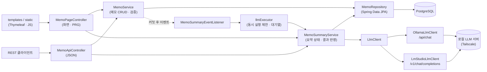
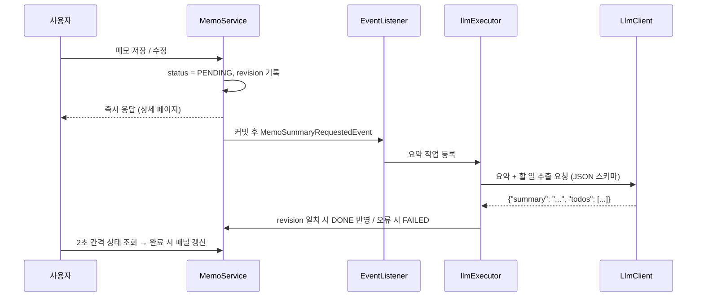
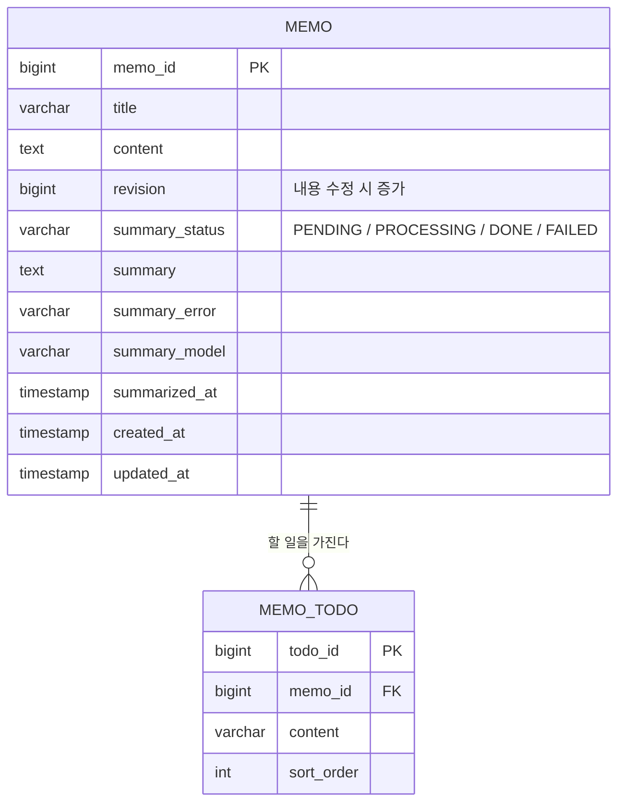

# AI 메모 자동 정리 프로그램

## 📁 프로젝트 개요

+ **AI 메모 자동 정리 프로그램(AI Memo)** 은 회의나 학습 중 작성한 메모가 정리되지 않은 채 쌓이고, 매번 직접 요약하고 할 일을 추려내야 하는 번거로움을 줄이기 위한 **Spring Boot 웹 애플리케이션**입니다.
+ 메모를 저장하면 **자체 호스팅한 로컬 LLM(Ollama / LM Studio)** 이 자동으로 호출되어 메모를 **요약**하고 **할 일 목록**을 추출합니다.
+ 메모와 요약 결과는 **PostgreSQL** 에 저장되며, 웹 화면(Thymeleaf)과 REST API 양쪽에서 **작성/조회/수정/삭제(CRUD)** 를 처리할 수 있습니다.
+ 로컬 LLM 응답은 수 초~수십 초가 걸리므로 저장 요청은 즉시 응답하고, 요약은 트랜잭션 커밋 이후 **비동기**로 처리합니다. 화면은 요약 상태(대기 → 요약 중 → 완료/실패)를 자동으로 갱신합니다.
+ LLM 서버는 **Tailscale** 로 연결된 자체 서버를 사용하며, 설정값 하나(`LLM_PROVIDER`)로 Ollama 와 LM Studio 를 전환할 수 있습니다.

## 🤝 팀 소개

<table border="1">
    <thead>
        <tr><td align="center">AI 메모 자동 정리 프로그램</td></tr>
    </thead>
    <tr align="center">
        <td>손수호</td>
    </tr>
    <tr>
        <td>
            <a href=https://github.com/Hasegos>
                
            </a>
        </td>
    </tr>
</table>

## 🛠️ 기술 스택

+ **Language**: 
+ **Framework**:  
+ **View**:  — 서버 렌더링 + Vanilla JS(요약 상태 폴링)
+ **Database**:  — 테스트는 H2(PostgreSQL 모드)
+ **AI 연동**:   — `RestClient`(JDK HttpClient) 로 직접 호출
+ **Infra**:   — 자체 서버 호스팅, PR 빌드·테스트 CI

## ✨ 핵심 기능

### 1) 메모 작성 / 저장
+ 제목(200자)·본문(20,000자) 입력, 필수값·길이 검증 실패 시 입력값을 유지한 채 필드별 에러 메시지 표시.
+ 저장 시 제목/본문 앞뒤 공백을 제거하고 작성일을 기록, PRG(Post-Redirect-Get) 로 새로고침 중복 저장 방지.
+ 글자 수 카운터, `Ctrl + Enter` 저장, 중복 제출 방지.

### 2) 로컬 LLM 자동 요약 / 할 일 추출
+ 메모 저장·내용 수정 시 로컬 LLM 을 자동 호출하여 **요약(3~5문장)** 과 **할 일 목록**을 추출합니다.
+ 두 런타임 모두 JSON 스키마 기반 구조화 출력(Ollama `format`, LM Studio `response_format`)으로 `{"summary", "todos"}` 형식을 강제합니다.
+ 모델이 설명 문장·코드 블록·`<think>` 블록을 섞어 답해도 JSON 부분만 추출하고, 할 일의 공백·중복을 정리합니다.
+ 연결 실패·응답 시간 초과·서버 오류(HTTP 상태 + 본문)를 사용자가 원인을 알 수 있는 문장으로 저장하고, **다시 시도** 버튼으로 재요약할 수 있습니다.

### 3) 메모 / 요약 조회
+ 최신순 카드 목록, 제목·본문 키워드 검색(대소문자 무시), 5개 단위 페이지네이션.
+ 목록 카드마다 요약 상태 배지(요약 대기 / 요약 중 / 요약 완료 / 요약 실패)와 할 일 개수 표시.
+ 상세 화면은 원문과 AI 요약 패널을 나란히 보여주며, 요약 중이면 2초 간격으로 상태를 확인해 완료 시 패널을 자동 갱신합니다.

### 4) 메모 수정 / 삭제
+ 작성 폼을 재사용한 수정 화면, 제목/본문이 **실제로 바뀐 경우에만** 기존 요약을 비우고 재요약합니다.
+ 삭제 전 확인창, 메모 삭제 시 추출된 할 일도 함께 삭제됩니다.

### 5) 요약 처리 규칙

| 규칙 | 처리 |
|---|---|
| 요약 시작 시점 | 저장/수정 트랜잭션 **커밋 이후** (커밋 전 메모를 조회하는 문제 방지) |
| 동시 실행 수 | `LLM_CONCURRENCY` (기본 1, GPU 1장 기준) — 나머지는 대기열(100건)에서 순서대로 처리 |
| 대기열 초과 | 해당 메모를 **요약 실패**로 기록 (재시도 가능) |
| 요약 중 수정·삭제 | `revision` 이 달라진 오래된 결과는 버리고 새 내용으로 다시 요약 |
| 중복 요청 | 이미 요약 중(대기/요약 중)인 메모의 재요약 요청은 무시 |
| 서버 재시작 | 끝나지 않은(대기/요약 중) 요약을 기동 시 자동으로 다시 요청 |

## 🖼️ 화면 구성

### 메모 목록


- 메인 담당자 : 손수호
- 주요 개발 기능 : 최신순 카드 목록, 제목·본문 검색, 요약 상태 배지·할 일 개수 표시, 빈 상태 안내, 페이지네이션

---

### 메모 작성 / 수정


- 메인 담당자 : 손수호
- 주요 개발 기능 : 제목·본문 입력 및 필드별 검증 메시지, 글자 수 카운터, `Ctrl + Enter` 저장, 작성/수정 폼 공용화

---

### 메모 상세 / AI 요약


- 메인 담당자 : 손수호
- 주요 개발 기능 : 원문 + AI 요약 패널 2단 레이아웃, 요약 상태 폴링 및 패널 자동 갱신, 할 일 목록, 실패 사유 표시 및 다시 시도, 수정/삭제

---

### 모바일 / 다크 모드


- 메인 담당자 : 손수호
- 주요 개발 기능 : 모바일에서 요약 우선 배치, 시스템 설정 연동 + 수동 전환 다크 모드

## 🧱 계층 구조

+ 화면(`MemoPageController`)과 API(`MemoApiController`)는 같은 서비스를 공유하며, 컨트롤러는 Repository 나 LLM 을 직접 호출하지 않습니다.
+ LLM 호출은 `LlmClient` 인터페이스 뒤에 숨겨 서비스가 런타임(Ollama / LM Studio)을 알지 못하도록 분리했습니다.



### 요약 처리 흐름



## 📊 ERD (Entity Relationship Diagram)



### 📝 Memo (메모)
| 필드명 | 타입 | 설명 |
|---|---|---|
| memo_id | BIGSERIAL | PK |
| title | VARCHAR(200) | 제목 (필수) |
| content | TEXT | 본문 (필수, 20,000자 이하) |
| revision | BIGINT | 제목/본문이 바뀔 때마다 증가 (오래된 요약 결과 폐기 기준) |
| summary_status | VARCHAR(20) | 요약 상태 (`PENDING` / `PROCESSING` / `DONE` / `FAILED`, CHECK 제약) |
| summary | TEXT | LLM 요약문 |
| summary_error | VARCHAR(500) | 요약 실패 사유 |
| summary_model | VARCHAR(100) | 요약에 사용한 모델명 |
| summarized_at | TIMESTAMP | 요약 완료 시각 |
| created_at / updated_at | TIMESTAMP | 작성/수정 시각 (수정 시각은 사용자가 수정했을 때만 갱신) |

### ✅ MemoTodo (할 일)
| 필드명 | 타입 | 설명 |
|---|---|---|
| todo_id | BIGSERIAL | PK |
| memo_id | BIGINT | 메모 FK (ON DELETE CASCADE) |
| content | VARCHAR(500) | 할 일 내용 |
| sort_order | INTEGER | LLM 이 추출한 순서 |

+ 요약 결과가 반영될 때 기존 할 일은 모두 지우고 새 목록으로 교체합니다(`orphanRemoval`).
+ 목록 최신순 정렬(`created_at DESC, memo_id DESC`)과 기동 시 미완료 요약 조회(`summary_status`)에 인덱스를 사용합니다.
+ 운영 환경은 `ddl-auto: validate` 이므로 최초 배포 전에 [`db/schema.sql`](src/main/resources/db/schema.sql) 로 테이블을 생성합니다.

## 🔒 데이터 무결성 / 동시성

+ **트랜잭션 분리**: LLM 호출(수 초~수십 초)은 트랜잭션 밖에서 수행해 DB 커넥션을 점유하지 않고, 상태 변경과 결과 반영만 짧은 `REQUIRES_NEW` 트랜잭션으로 처리합니다.
+ **커밋 후 실행**: `@TransactionalEventListener(AFTER_COMMIT)` 로 저장이 확정된 뒤에만 요약을 시작합니다.
+ **경합 처리**: 요약 요청 시점의 `revision` 과 결과 반영 시점의 `revision` 을 비교해, 요약 중 메모가 수정·삭제되면 오래된 결과를 버립니다.
+ **자원 제한**: 로컬 LLM 은 GPU 를 공유하므로 전용 실행기(`llmExecutor`)로 동시 실행 수와 대기열 크기를 제한합니다.
+ **장애 복구**: 서버가 요약 도중 종료되어도 기동 시(`ApplicationReadyEvent`) 대기/요약 중 상태의 메모를 다시 요청합니다.
+ **입력 검증**: Bean Validation(`@NotBlank`, `@Size`)으로 화면·API 모두 동일하게 검증하고, 검색 키워드의 `%`, `_` 는 와일드카드로 해석되지 않도록 이스케이프합니다.
+ **예외 응답**: 화면 요청은 상태 코드(400/404/405/500)별 에러 페이지, API 요청은 `ErrorResponse`(status, message, errors) JSON 으로 응답합니다.
+ **보안**: 본문은 Thymeleaf `th:text` 로 출력해 XSS 를 방지하고, 세션 ID 가 URL(`;jsessionid=`)에 노출되지 않도록 쿠키로만 추적합니다.

## 📁 디렉토리 구조

```text
📦 coding-test-project/
├── ⚙️ pom.xml                          # Spring Boot 4.0.6 / Java 21 의존성
├── 🔧 mvnw, mvnw.cmd                   # Maven Wrapper
├── 🤖 .github/workflows/
│   ├── ci.yml                          # dev/master PR 빌드·테스트
│   └── pr-source-guard.yml             # master 는 dev 에서만 PR 허용
├── 🖼️ img/                             # README 화면 캡처
└── 📂 src/
    ├── main/java/io/dev/coding_test/
    │   ├── 🚀 CodingTestApplication.java    # 실행 진입점
    │   ├── ⚙️ common/
    │   │   ├── config/AsyncConfig.java      # LLM 요약 전용 실행기(동시 실행 수·대기열)
    │   │   ├── exception/                   # NotFoundException
    │   │   ├── handler/                     # ApiExceptionHandler(JSON) / GlobalExceptionHandler(에러 페이지)
    │   │   └── util/PageRangeUtil.java      # 페이지네이션 번호 계산
    │   ├── 🎮 controller/
    │   │   ├── HomeController.java          # / → /memos
    │   │   ├── MemoPageController.java      # Thymeleaf 화면 (작성·목록·상세·수정·삭제·요약 패널)
    │   │   └── MemoApiController.java       # REST API (/api/memos)
    │   ├── 🧩 dto/                          # MemoRequest, MemoResponse, MemoListItem, MemoSummaryResponse, PageResponse, ErrorResponse
    │   ├── 📣 event/
    │   │   ├── MemoSummaryRequestedEvent.java   # 요약 요청 이벤트 (memoId, revision)
    │   │   └── MemoSummaryEventListener.java    # 커밋 후 실행기 등록, 기동 시 미완료 요약 재요청
    │   ├── 🤖 llm/
    │   │   ├── LlmClient.java               # 요약 클라이언트 인터페이스
    │   │   ├── AbstractLlmClient.java       # 공통 흐름, 오류 메시지 변환
    │   │   ├── OllamaLlmClient.java         # Ollama /api/chat
    │   │   ├── LmStudioLlmClient.java       # LM Studio /v1/chat/completions
    │   │   ├── LlmConfig.java               # provider 에 따른 구현체 선택, RestClient 설정
    │   │   ├── LlmProperties.java           # llm.* 설정 (provider, base-url, model, timeout ...)
    │   │   ├── LlmProvider.java             # OLLAMA / LMSTUDIO, 기본 주소
    │   │   ├── SummaryPrompt.java           # 프롬프트, 응답 JSON 스키마
    │   │   ├── SummaryResultParser.java     # LLM 응답 JSON 추출·정리
    │   │   ├── SummaryResult.java
    │   │   └── LlmException.java
    │   ├── 🧾 model/                        # Memo, MemoTodo, SummaryStatus (JPA 엔티티)
    │   ├── 💾 repository/MemoRepository.java
    │   └── 🔄 service/
    │       ├── MemoService.java             # 메모 CRUD, 검색, 요약 요청
    │       └── MemoSummaryService.java      # 비동기 요약 실행, 결과 반영, 재요약
    ├── main/resources/
    │   ├── application.yml                  # 공통 설정 (DB·LLM 환경변수)
    │   ├── application-dev.yml              # ddl-auto: update
    │   ├── application-prod.yml             # ddl-auto: validate
    │   ├── logback-spring.xml
    │   ├── db/schema.sql                    # PostgreSQL 스키마
    │   ├── templates/
    │   │   ├── fragments/                   # head, header, footer
    │   │   ├── memo/                        # list, form, detail, summary(요약 패널 fragment)
    │   │   └── error/error.html
    │   └── static/
    │       ├── css/common/                  # reset, common(디자인 토큰), header, footer
    │       ├── css/pages/                   # memo-list, memo-form, memo-detail, error
    │       └── js/                          # common, memo-form, memo-detail(요약 폴링)
    └── test/java/io/dev/coding_test/
        ├── controller/                      # 화면·API MockMvc 테스트
        ├── service/                         # 메모 CRUD, 비동기 요약·경합 테스트
        ├── llm/                             # Ollama/LM Studio 요청 형식, 파서, 오류 변환 테스트
        └── support/FakeLlmClient.java       # 테스트용 가짜 LLM
```

## 🔌 API

| Method | URL | 설명 |
|---|---|---|
| `POST` | `/api/memos` | 메모 작성 (201, 요약 자동 시작) |
| `GET` | `/api/memos?keyword=&page=&size=` | 메모 목록 (최신순, 검색) |
| `GET` | `/api/memos/{id}` | 메모 단건 + 요약 결과 |
| `PUT` | `/api/memos/{id}` | 메모 수정 (내용 변경 시 재요약) |
| `DELETE` | `/api/memos/{id}` | 메모 삭제 (204) |
| `GET` | `/api/memos/{id}/summary` | 요약 상태/결과 조회 |
| `POST` | `/api/memos/{id}/summary` | 재요약 요청 (202) |

## 🌿 브랜치 전략

| 브랜치 | 용도 |
|---|---|
| `master` | 배포(안정) 브랜치 — `dev` 에서만 PR 허용 |
| `dev` | 개발 통합 브랜치 |
| `feature/coding-test-기능` | 기능 단위 개발 브랜치, 완료 후 `dev` 로 PR/merge |

## 🚀 실행 방법

```bash
# 1. PostgreSQL 에 데이터베이스 생성
createdb -U postgres ai_memo

# 2. (운영 프로파일만) 테이블 생성 — dev 프로파일은 자동 생성
psql -U postgres -d ai_memo -f src/main/resources/db/schema.sql

# 3. 실행 (http://localhost:8083)
./mvnw spring-boot:run                                   # dev 프로파일
./mvnw spring-boot:run -Dspring-boot.run.profiles=prod   # prod 프로파일

# 테스트 (PostgreSQL·LLM 없이 H2 + 가짜 LLM 으로 실행)
./mvnw verify
```

+ 실행 전 아래 환경변수를 설정합니다. (IntelliJ: Run Configuration → Environment variables 에 `.env` 파일 지정)

```properties
# PostgreSQL
POSTGRESQL_HOST=localhost
POSTGRESQL_PORT=5432
POSTGRESQL_DATABASE=ai_memo
POSTGRESQL_USERNAME=postgres
POSTGRESQL_PASSWORD=비밀번호

# 로컬 LLM — LM Studio 예시
LLM_PROVIDER=lmstudio
LLM_BASE_URL=http://100.x.x.x:1234
LLM_MODEL=qwen2.5-vl-7b-instruct
LLM_API_KEY=
LLM_READ_TIMEOUT=120s
LLM_CONCURRENCY=1
```

| 환경변수 | 기본값 | 설명 |
|---|---|---|
| `LLM_PROVIDER` | `ollama` | `ollama` \| `lmstudio` |
| `LLM_BASE_URL` | 런타임별 기본 주소 | 비우면 ollama `http://localhost:11434`, lmstudio `http://localhost:1234` |
| `LLM_MODEL` | `qwen2.5:7b` | 로드된 모델 ID 와 정확히 일치해야 함 |
| `LLM_API_KEY` | - | LM Studio 인증 토큰 (선택) |
| `LLM_READ_TIMEOUT` | `120s` | LLM 응답 대기 시간 |
| `LLM_CONCURRENCY` | `1` | 동시 요약 수 |

+ LLM 서버가 꺼져 있어도 애플리케이션은 정상 기동되며, 해당 메모는 **요약 실패**로 표시되고 서버를 켠 뒤 **다시 시도**로 재요약할 수 있습니다.
