# AI 메모 자동 정리 프로그램

## 📁 프로젝트 개요

+ **AI 메모 자동 정리 프로그램(AI Memo)** 은 회의나 학습 중 작성한 메모가 정리되지 않은 채 쌓이고, 매번 직접 요약하고 할 일을 추려내야 하는 번거로움을 줄이기 위한 **Spring Boot 웹 애플리케이션**입니다.
+ 메모를 저장하면 **자체 호스팅한 로컬 LLM(Ollama / LM Studio)** 이 자동으로 호출되어 메모를 **요약**하고 **할 일 목록**을 추출합니다.
+ **회원가입·로그인** 후 사용하며, 메모와 LLM 설정은 **회원별로 분리**됩니다. 다른 회원의 메모는 볼 수도 고칠 수도 없습니다.
+ 메모와 요약 결과는 **PostgreSQL** 에 저장되며, 웹 화면(Thymeleaf)과 REST API 양쪽에서 **작성/조회/수정/삭제(CRUD)** 를 처리할 수 있습니다.
+ 로컬 LLM 응답은 수 초~수십 초가 걸리므로 저장 요청은 즉시 응답하고, 요약은 트랜잭션 커밋 이후 **비동기**로 처리합니다. 화면은 요약 상태(대기 → 요약 중 → 완료/실패)를 자동으로 갱신합니다.
+ LLM 서버 주소는 회원마다 **LLM 설정 화면**에서 입력합니다. **Tailscale** 로 연결된 자체 서버의 로컬 IP 를 입력하고 연결 테스트로 모델을 불러와 선택하며, Ollama 와 LM Studio 를 전환할 수 있습니다.

## 🤝 팀 소개

<table border="1">
    <thead>
        <tr><td align="center">AI 메모 자동 정리 프로그램</td></tr>
    </thead>
    <tr align="center">
        <td>손수호</td>
    </tr>
    <tr>
        <td>
            <a href=https://github.com/Hasegos>
                
            </a>
        </td>
    </tr>
</table>

## 🛠️ 기술 스택

+ **Language**: 
+ **Framework**:   
+ **View**:  — 서버 렌더링 + Vanilla JS(요약 상태 폴링, 연결 테스트)
+ **Database**:  — 테스트는 H2(PostgreSQL 모드)
+ **AI 연동**:   — `RestClient`(JDK HttpClient) 로 직접 호출
+ **Infra**:   — 자체 서버 호스팅, PR 빌드·테스트 CI

## ✨ 핵심 기능

### 1) 회원가입 / 로그인
+ 아이디(**이메일**, 100자 이하)·비밀번호(**영문·숫자·특수문자 포함 8~64자**)·비밀번호 확인·닉네임(2~12자)으로 가입합니다.
+ 회원가입과 로그인 모두 같은 정규식으로 **화면(JS)과 서버(Java)** 에서 검증합니다. 로그인은 형식이 틀리면 DB 를 조회하지 않고 바로 안내합니다.
+ 비밀번호는 **BCrypt 해시**로만 저장하고, 세션 기반 폼 로그인을 사용합니다. 로그인 후에는 처음 요청했던 화면으로 돌아갑니다.
+ 비밀번호를 **5회 틀리면 5분간 로그인이 잠깁니다.** (같은 IP·아이디 기준, 같은 IP 에서 아이디를 바꿔 가며 20회 틀려도 잠금) 형식 오류는 세지 않습니다.
+ 로그인하면 우측 상단에 **닉네임 메뉴**가 생기고, 그 안에서 다크/라이트 모드 전환과 로그아웃을 할 수 있습니다.
+ 메모·요약·LLM 설정은 모두 로그인한 회원 기준으로 처리되며, 요약은 **메모 작성자의 LLM 서버**로 실행됩니다.

### 2) 메모 작성 / 저장
+ 제목(200자)·본문(20,000자) 입력, 필수값·길이 검증 실패 시 입력값을 유지한 채 필드별 에러 메시지 표시.
+ 저장 시 제목/본문 앞뒤 공백을 제거하고 작성일을 기록, PRG(Post-Redirect-Get) 로 새로고침 중복 저장 방지.
+ 글자 수 카운터, `Ctrl + Enter` 저장, 중복 제출 방지.

### 3) 로컬 LLM 자동 요약 / 할 일 추출
+ 메모 저장·내용 수정 시 로컬 LLM 을 자동 호출하여 **요약(3~5문장)** 과 **할 일 목록**을 추출합니다.
+ 두 런타임 모두 JSON 스키마 기반 구조화 출력(Ollama `format`, LM Studio `response_format`)으로 `{"summary", "todos"}` 형식을 강제합니다.
+ 모델이 설명 문장·코드 블록·`<think>` 블록을 섞어 답해도 JSON 부분만 추출하고, 할 일의 공백·중복을 정리합니다.
+ 작은 모델이 예시를 결과에 옮겨 적지 않도록 프롬프트에는 구체적인 예시 값 없이 형식만 적고, 메모에 없는 담당자·기한이 붙은 할 일은 버립니다.
+ 연결 실패·응답 시간 초과·서버 오류를 원인을 알 수 있는 문장으로 저장하고, **다시 시도** 버튼으로 재요약할 수 있습니다.

### 4) LLM 설정 (Tailscale IP 입력)
+ 런타임(Ollama / LM Studio), 서버 IP, 포트, API Key(선택)를 입력하고 **연결 테스트**로 서버의 모델 목록을 불러와 선택합니다.
+ LLM 설정은 회원마다 따로 저장되고, API Key 는 **AES-256-GCM 으로 암호화**해 DB 에 저장합니다.
+ 서버가 입력한 주소로 직접 요청하므로 **IP 숫자 주소만** 허용하고, 기본값은 **Tailscale 대역만** 허용합니다. 거부 사유에 맞는 안내 문구를 보여줍니다.
+ 가정·학교의 PC 는 공유기 뒤의 사설 IP 를 쓰므로, LLM PC 가 서버와 다른 네트워크에 있으면 사설 IP·공인 IP 로는 연결할 수 없습니다. 그래서 설정 화면에 **Tailscale 연결 가이드**(설치 → LLM PC 를 운영자에게 공유 → 서버 열기 → Tailscale IP 입력 → 연결 테스트)를 보여주고, 운영자 이메일(`llm.guard.share-email`)을 설정하면 가이드에 표시합니다.

| LLM PC 위치 | 연결 방법 |
|---|---|
| 서버와 같은 PC · 같은 공유기 | Tailscale IP (서버와 같은 LAN 만 쓴다면 `llm.guard.allowed-networks: []` 로 사설 IP 허용 가능) |
| 다른 집 · 학교 · 회사 | Tailscale IP — 사설 IP 는 밖에서 닿지 않고, 공인 IP 는 공유기 주소라 포트포워딩 없이는 닿지 않음 |

| 입력 | 결과 |
|---|---|
| Tailscale `100.64~127.x` · `fd7a:115c:a1e0::/48` | ✅ 허용 |
| `10.x` · `172.16~31.x` · `192.168.x` · IPv6 ULA `fc00::/7` | ❌ 기본 거부 — Tailscale 연결 가이드 안내 (`allowed-networks: []` 설정 시 허용) |
| `localhost` · `*.localhost` · `host.docker.internal` · `127.x` · `0.0.0.0` · `::1` | ❌ 루프백 — Tailscale 연결 가이드 안내 |
| `169.254.x`(클라우드 메타데이터) · 멀티캐스트 · 예약·문서용 대역 · `fe80::` | ❌ 차단 대역 |
| 공인 IP · 도메인 · 비표준 표기(`127.1`, `2130706433`, `010.0.0.1`) · DB 서버 주소 | ❌ 거부 |
| 허용 포트(기본 `1234`, `11434`) 밖의 포트 | ❌ 거부 — 허용 포트 안내 |

+ IPv6 안에 IPv4 가 들어간 주소(`::ffff:127.0.0.1`, 6to4)는 안쪽 IPv4 기준으로 판단하고, 저장할 때와 **호출 직전 모두** 검사합니다.
+ 연결 테스트는 소요 시간과 모델 목록을 보여주며, 임베딩 등 채팅에 쓸 수 없는 모델은 목록에서 뺍니다.
+ 연결 테스트와 서버 주소 변경은 회원마다 **1분에 10회**까지만 할 수 있습니다. (내부망의 열린 포트를 하나씩 확인하는 것 방지)
+ **다른 회원이 이미 등록한 LLM 서버**(IP·포트)는 그 서버의 인증 토큰을 알아야 등록할 수 있습니다. 토큰 없이 요청해 서버가 인증을 요구하는지, 입력한 토큰으로 요청해 성공하는지 확인하며, 인증이 꺼진 서버는 아무 토큰이나 통과하므로 등록할 수 없습니다. (IP 만 알면 남의 GPU 를 쓰는 것 방지)
+ Tailscale 주소에 연결하지 못하면 "LLM PC 의 Tailscale·LLM 서버가 켜져 있는지, 운영자에게 공유하고 수락됐는지"를 함께 안내합니다.
+ 설정을 저장하면 그동안 요약에 실패했던 메모를 자동으로 다시 요약합니다. 설정 전에는 헤더와 목록에 안내가 표시됩니다.

### 5) 메모 / 요약 조회
+ 최신순 카드 목록, 제목·본문 키워드 검색(대소문자 무시), 5개 단위 페이지네이션.
+ 목록 카드마다 요약 상태 배지(요약 대기 / 요약 중 / 요약 완료 / 요약 실패)와 할 일 개수 표시.
+ 상세 화면은 원문과 AI 요약 패널을 나란히 보여주며, 요약 중이면 상태를 확인해 완료 시 패널을 자동 갱신합니다.

### 6) 메모 수정 / 삭제
+ 작성 폼을 재사용한 수정 화면, 제목/본문이 **실제로 바뀐 경우에만** 기존 요약을 비우고 재요약합니다.
+ 삭제 전 확인창, 메모 삭제 시 추출된 할 일도 함께 삭제됩니다.

### 7) 요약 처리 규칙

| 규칙 | 처리 |
|---|---|
| 요약 시작 시점 | 저장/수정 트랜잭션 **커밋 이후** (커밋 전 메모를 조회하는 문제 방지) |
| 동시 실행 수 | **LLM 서버(`IP:포트`)마다** 1개(GPU 1장 기준) — 같은 서버의 요약은 서버별 대기열(100건)에서 순서대로, **다른 서버는 동시에** 처리(전체 최대 8개) |
| 느린 서버 | 한 회원의 서버가 느리거나 꺼져 있어도 다른 서버를 쓰는 회원의 요약은 기다리지 않음 (측정: 15초 서버 뒤에 저장한 1초 서버 요약 16.3초 → 1.8초) |
| 대기열 초과 | 해당 메모를 **요약 실패**로 기록 (재시도 가능), 다른 서버의 대기열은 영향 없음 |
| 요약 중 수정·삭제 | `revision` 이 달라진 오래된 결과는 버리고 새 내용으로 다시 요약 |
| 중복 요청 | 이미 요약 중(대기/요약 중)인 메모의 재요약 요청은 무시 |
| LLM 미설정 | "LLM 설정에서 로컬 IP 를 입력" 안내와 함께 실패 처리, 설정 저장 시 자동 재요약 |
| 서버 재시작 | 끝나지 않은(대기/요약 중) 요약을 기동 시 자동으로 다시 요청 |

## 🖼️ 화면 구성

### 회원가입 / 로그인
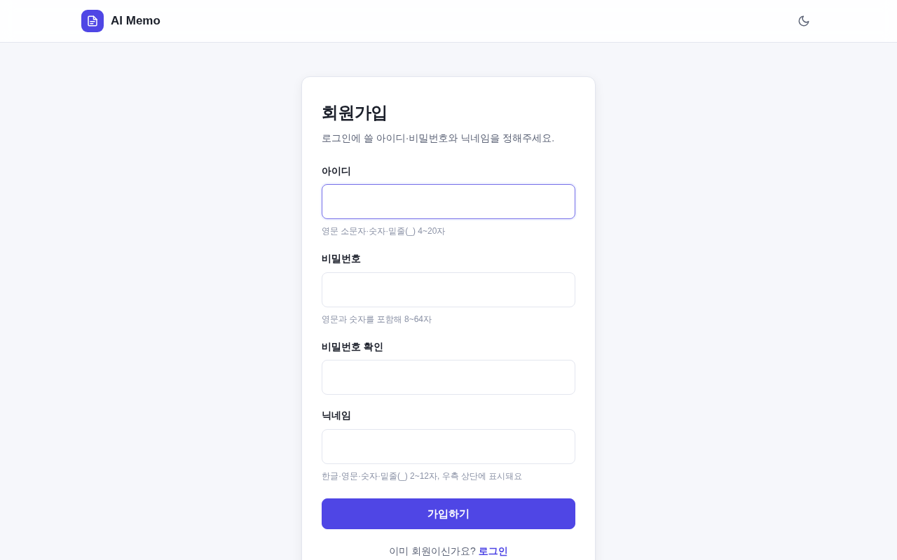
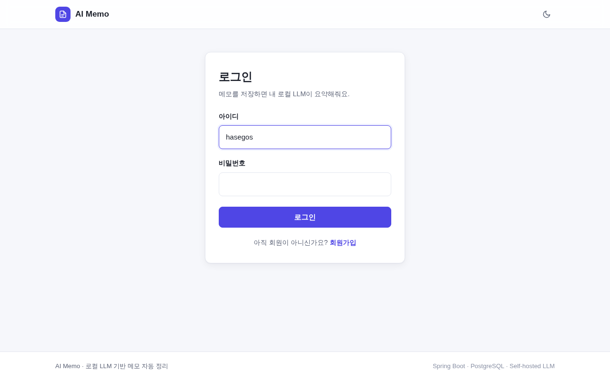

- 메인 담당자 : 손수호
- 주요 개발 기능 : 이메일·비밀번호(영문·숫자·특수문자)·비밀번호 확인·닉네임 정규식 검증(화면·서버), 가입 후 이메일이 채워진 로그인 화면으로 이동, 로그인 실패 원인별 안내

---

### 닉네임 메뉴
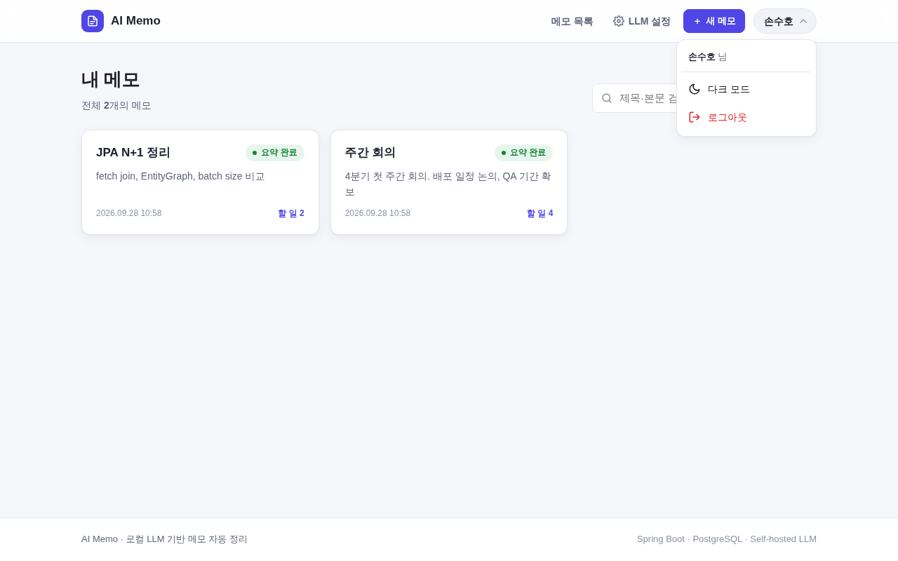

- 메인 담당자 : 손수호
- 주요 개발 기능 : 우측 상단 닉네임 메뉴(다크/라이트 모드 전환·로그아웃), 바깥 클릭·Esc 로 닫기

---

### 메모 목록
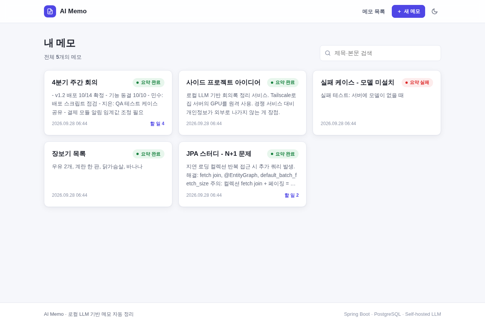

- 메인 담당자 : 손수호
- 주요 개발 기능 : 최신순 카드 목록, 제목·본문 검색, 요약 상태 배지·할 일 개수 표시, 빈 상태 안내, 페이지네이션

---

### 메모 작성 / 수정
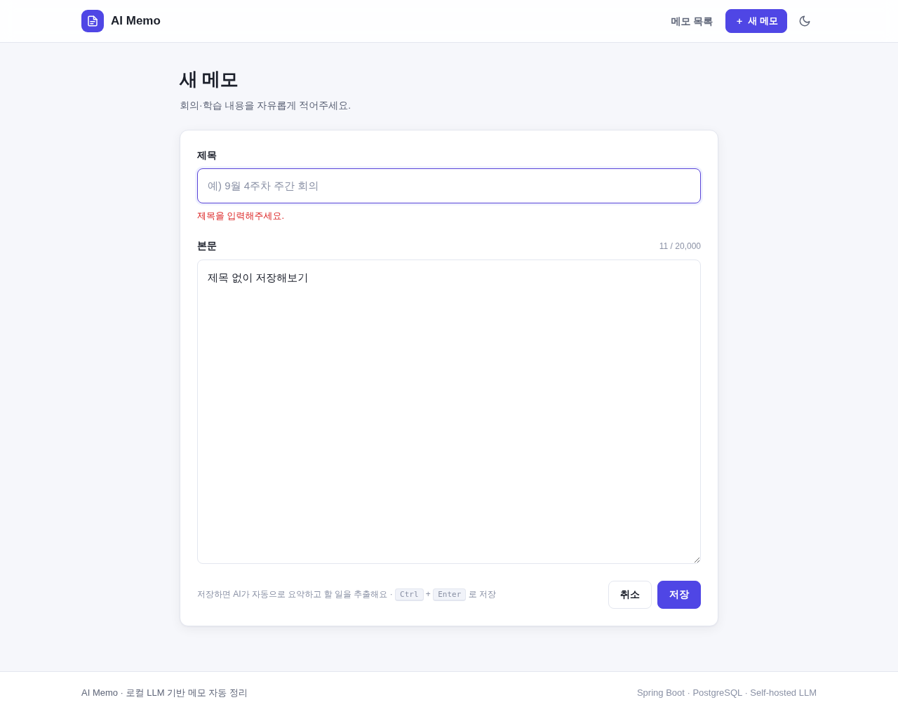

- 메인 담당자 : 손수호
- 주요 개발 기능 : 제목·본문 입력 및 필드별 검증 메시지, 글자 수 카운터, `Ctrl + Enter` 저장, 작성/수정 폼 공용화

---

### 메모 상세 / AI 요약
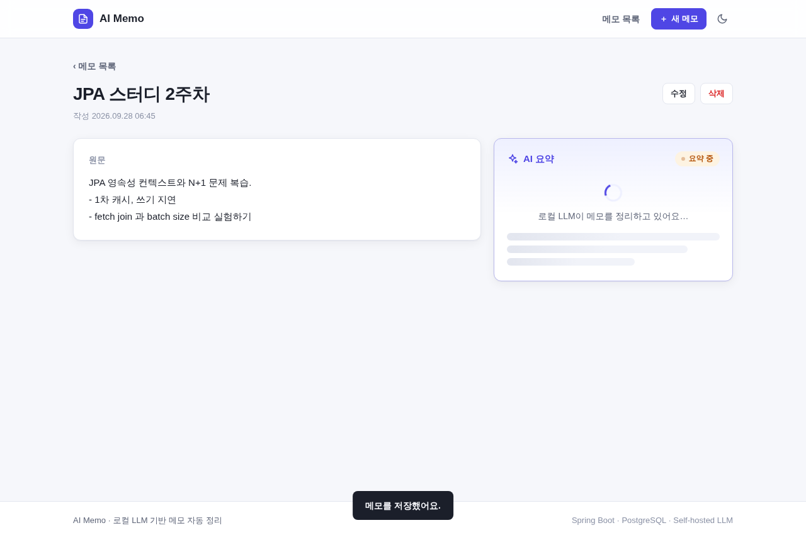
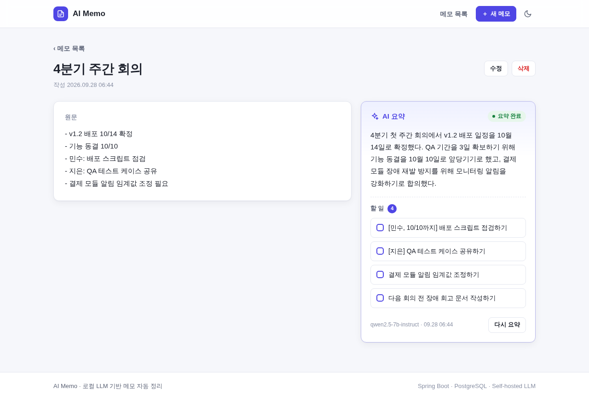
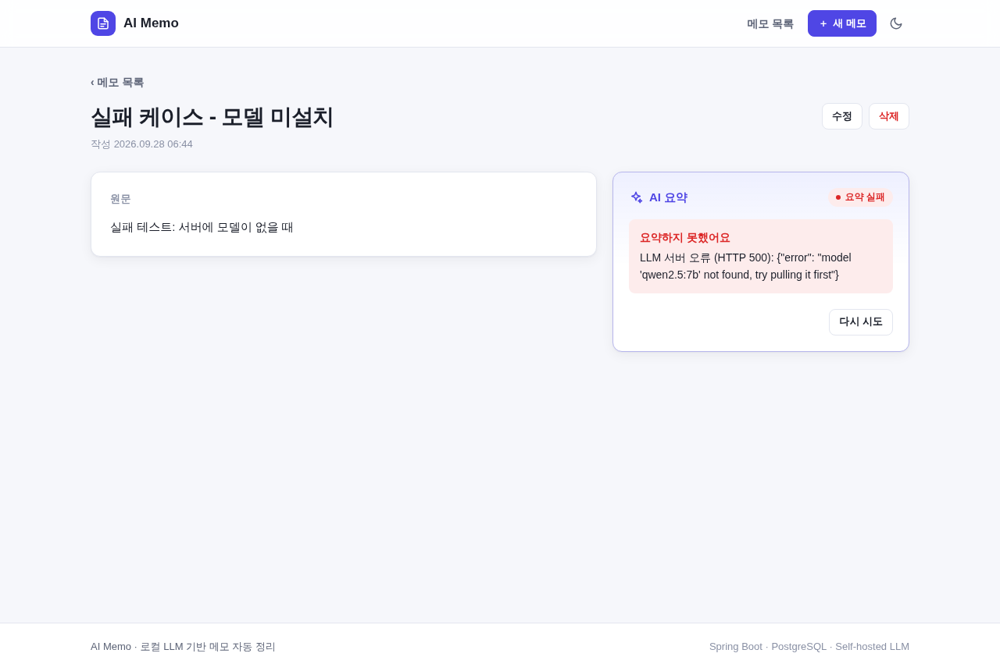

- 메인 담당자 : 손수호
- 주요 개발 기능 : 원문 + AI 요약 패널 2단 레이아웃, 요약 상태 폴링 및 패널 자동 갱신, 할 일 목록, 실패 사유 표시 및 다시 시도, 수정/삭제

---

### LLM 설정
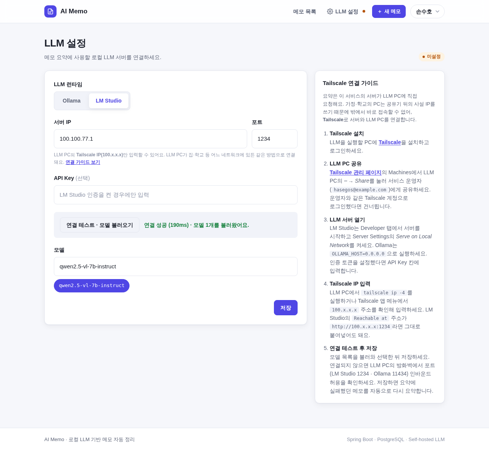
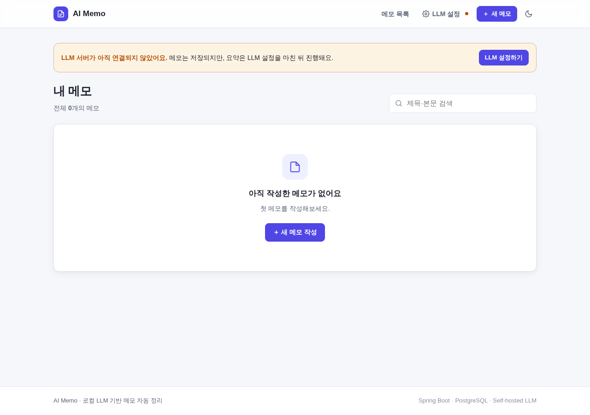

- 메인 담당자 : 손수호
- 주요 개발 기능 : 런타임 선택(기본 포트 자동 변경), Tailscale IP 검증과 연결 가이드, 연결 테스트 및 모델 목록 선택, API Key 저장·유지·삭제, 미설정 안내 배너

---

### 모바일 / 다크 모드
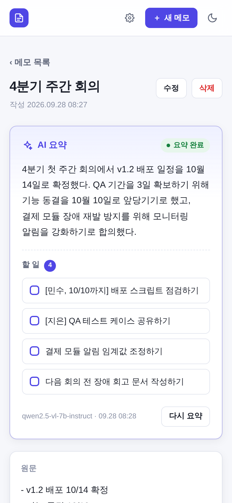
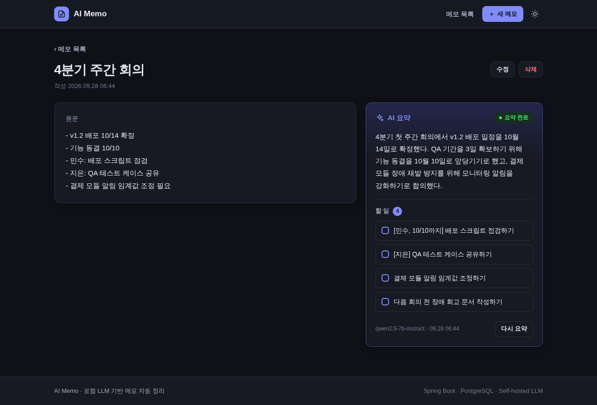

- 메인 담당자 : 손수호
- 주요 개발 기능 : 모바일에서 요약 우선 배치, 시스템 설정 연동 + 수동 전환 다크 모드

## 🧱 계층 구조

+ 컨트롤러는 `@LoginUserId` 로 로그인한 회원 ID 를 받아 서비스에 넘기고, 서비스·Repository 는 모든 조회에 작성자 조건을 겁니다.
+ 화면 컨트롤러와 API 컨트롤러는 같은 서비스를 공유하며, 컨트롤러는 Repository 나 LLM 을 직접 호출하지 않습니다.
+ 엔티티(model)는 데이터만 가지고, 값 변경 규칙(수정 여부 판단, revision 증가, 요약 상태 변경)은 모두 service 가 담당합니다.

### 요청 처리 계층

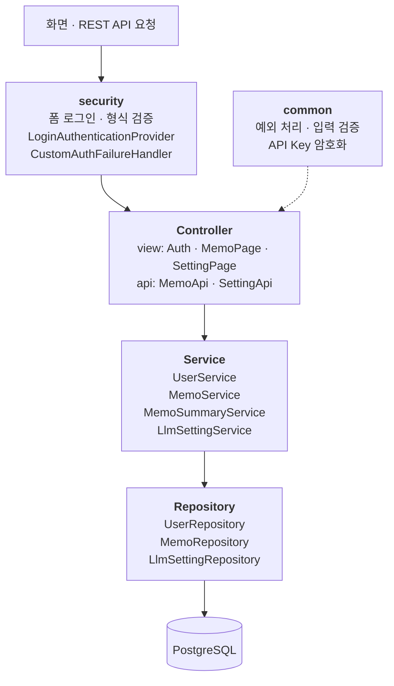
```mermaid
flowchart TB
    P["화면 · REST API 요청"]
    SEC["<b>security</b><br/>폼 로그인 · 형식 검증<br/>LoginAuthenticationProvider<br/>CustomAuthFailureHandler"]
    C["<b>Controller</b><br/>view: Auth · MemoPage · SettingPage<br/>api: MemoApi · SettingApi"]
    S["<b>Service</b><br/>UserService<br/>MemoService<br/>MemoSummaryService<br/>LlmSettingService"]
    R["<b>Repository</b><br/>UserRepository<br/>MemoRepository<br/>LlmSettingRepository"]
    DB[("PostgreSQL")]
    X["<b>common</b><br/>예외 처리 · 입력 검증<br/>API Key 암호화"]

    P --> SEC --> C --> S --> R --> DB
    X -.-> C
```

### 요약 처리 (비동기)

+ LLM 호출은 `LlmClient` 인터페이스 뒤에 숨겨, 서비스는 런타임(Ollama / LM Studio)을 알지 못합니다.

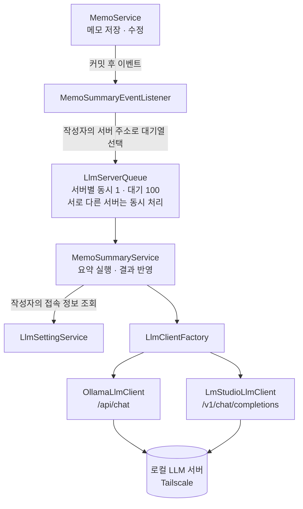
```mermaid
flowchart TB
    A["MemoService<br/>메모 저장 · 수정"] -->|"커밋 후 이벤트"| B["MemoSummaryEventListener"]
    B -->|"작성자의 서버 주소로 대기열 선택"| C["LlmServerQueue<br/>서버별 동시 1 · 대기 100<br/>서로 다른 서버는 동시 처리"]
    C --> D["MemoSummaryService<br/>요약 실행 · 결과 반영"]
    D -->|"작성자의 접속 정보 조회"| E["LlmSettingService"]
    D --> F["LlmClientFactory"]
    F --> G["OllamaLlmClient<br/>/api/chat"]
    F --> H["LmStudioLlmClient<br/>/v1/chat/completions"]
    G --> I[("로컬 LLM 서버<br/>Tailscale")]
    H --> I
```

### 요약 처리 순서

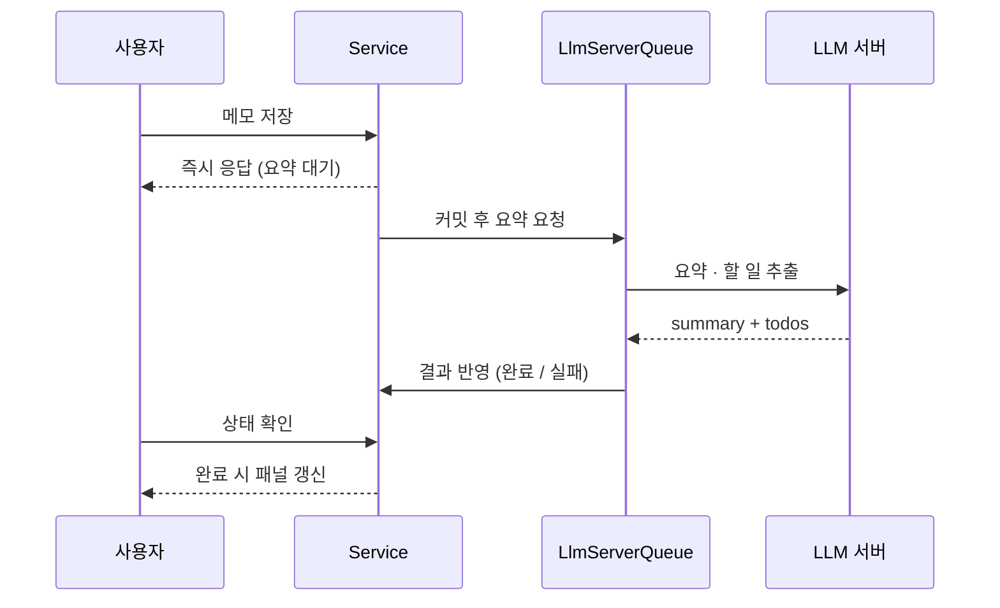
```mermaid
sequenceDiagram
    participant U as 사용자
    participant S as Service
    participant E as LlmServerQueue
    participant M as LLM 서버
    U->>S: 메모 저장
    S-->>U: 즉시 응답 (요약 대기)
    S->>E: 커밋 후 요약 요청
    E->>M: 요약 · 할 일 추출
    M-->>E: summary + todos
    E->>S: 결과 반영 (완료 / 실패)
    U->>S: 상태 확인
    S-->>U: 완료 시 패널 갱신
```

## 📊 ERD (Entity Relationship Diagram)

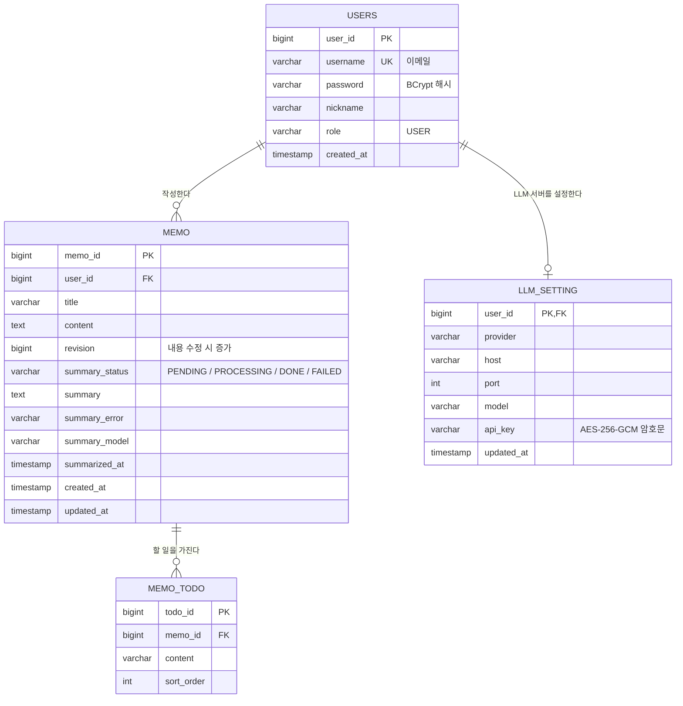
```mermaid
erDiagram
    USERS ||--o{ MEMO : "작성한다"
    USERS ||--o| LLM_SETTING : "LLM 서버를 설정한다"
    MEMO ||--o{ MEMO_TODO : "할 일을 가진다"
    USERS {
        bigint user_id PK
        varchar username UK "이메일"
        varchar password "BCrypt 해시"
        varchar nickname
        varchar role "USER"
        timestamp created_at
    }
    MEMO {
        bigint memo_id PK
        bigint user_id FK
        varchar title
        text content
        bigint revision "내용 수정 시 증가"
        varchar summary_status "PENDING / PROCESSING / DONE / FAILED"
        text summary
        varchar summary_error
        varchar summary_model
        timestamp summarized_at
        timestamp created_at
        timestamp updated_at
    }
    MEMO_TODO {
        bigint todo_id PK
        bigint memo_id FK
        varchar content
        int sort_order
    }
    LLM_SETTING {
        bigint user_id PK, FK
        varchar provider
        varchar host
        int port
        varchar model
        varchar api_key "AES-256-GCM 암호문"
        timestamp updated_at
    }
```

### 👤 User (회원, `users`)
| 필드명 | 타입 | 설명 |
|---|---|---|
| user_id | BIGSERIAL | PK |
| username | VARCHAR(100) | 로그인 아이디 — 이메일 (UNIQUE, 소문자로 저장) |
| password | VARCHAR(100) | BCrypt 해시 (`{bcrypt}$2a$10$…`) |
| nickname | VARCHAR(20) | 닉네임 (헤더 표시) |
| role | VARCHAR(20) | 역할 (`USER` → `ROLE_USER`) |
| created_at | TIMESTAMP | 가입 시각 |

### 📝 Memo (메모)
| 필드명 | 타입 | 설명 |
|---|---|---|
| memo_id | BIGSERIAL | PK |
| user_id | BIGINT | 작성자 FK (ON DELETE CASCADE) — 작성자만 조회·수정·삭제 |
| title | VARCHAR(200) | 제목 (필수) |
| content | TEXT | 본문 (필수, 20,000자 이하) |
| revision | BIGINT | 제목/본문이 바뀔 때마다 증가 (오래된 요약 결과 폐기 기준) |
| summary_status | VARCHAR(20) | 요약 상태 (`PENDING` / `PROCESSING` / `DONE` / `FAILED`, CHECK 제약) |
| summary | TEXT | LLM 요약문 |
| summary_error | VARCHAR(500) | 요약 실패 사유 |
| summary_model | VARCHAR(100) | 요약에 사용한 모델명 |
| summarized_at | TIMESTAMP | 요약 완료 시각 |
| created_at / updated_at | TIMESTAMP | 작성/수정 시각 (수정 시각은 사용자가 수정했을 때만 갱신) |

### ✅ MemoTodo (할 일)
| 필드명 | 타입 | 설명 |
|---|---|---|
| todo_id | BIGSERIAL | PK |
| memo_id | BIGINT | 메모 FK (ON DELETE CASCADE) |
| content | VARCHAR(500) | 할 일 내용 |
| sort_order | INTEGER | LLM 이 추출한 순서 |

### ⚙️ LlmSetting (LLM 접속 설정)

+ 회원당 1행이며, 회원 ID 를 그대로 기본키로 씁니다.

| 필드명 | 타입 | 설명 |
|---|---|---|
| user_id | BIGINT | PK, 회원 FK (ON DELETE CASCADE) |
| provider | VARCHAR(20) | `OLLAMA` / `LMSTUDIO` (CHECK 제약) |
| host | VARCHAR(45) | 로컬 전용 IP (사설망·Tailscale 대역, IPv6 포함) |
| port | INTEGER | 포트 (1~65535, CHECK 제약) |
| model | VARCHAR(100) | 요약에 사용할 모델명 |
| api_key | VARCHAR(400) | 인증 토큰 (선택) — `v1:` + AES-256-GCM 암호문으로 저장, 화면·API 응답·로그에 노출하지 않음 |
| updated_at | TIMESTAMP | 마지막 저장 시각 |

+ 요약 결과가 반영될 때 기존 할 일은 모두 지우고 새 목록으로 교체합니다(`orphanRemoval`).
+ 회원별 목록 최신순 정렬(`user_id, created_at DESC, memo_id DESC`)과 미완료 요약 조회(`summary_status`)에 인덱스를 사용합니다.
+ 운영 환경은 `ddl-auto: validate` 이므로 최초 배포 전에 [`db/schema.sql`](src/main/resources/db/schema.sql) 로 테이블을 생성합니다. 회원 기능 이전 버전 DB 는 `DROP TABLE IF EXISTS memo_todo, memo, llm_setting, member, users;` 후 스크립트를 다시 실행합니다. (구조가 바뀜)

## 🔒 보안

| 위협 | 대응 |
|---|---|
| 인증 | 세션 기반 폼 로그인. 로그인·회원가입·정적 리소스 외 모든 요청은 로그인 필요 (화면은 로그인 화면으로, API 는 401 JSON) |
| 비밀번호 유출 | BCrypt 해시(`{bcrypt}` 위임 인코더)로만 저장, 세션의 로그인 정보에서도 비밀번호 해시 제거 |
| 로그인 입력 | 이메일·비밀번호 형식을 회원 조회 전에 검사(`LoginAuthenticationProvider`), 가입되지 않은 이메일과 틀린 비밀번호는 같은 문구로 안내(`CustomAuthFailureHandler`), 실패 문구는 URL 이 아니라 세션으로 한 번만 전달 |
| 비밀번호 무차별 대입 | 비밀번호 5회 실패(같은 IP·아이디) 또는 20회 실패(같은 IP) 시 5분 잠금(`LoginAttemptService`), 잠긴 동안은 맞는 비밀번호도 거부. 다른 IP 는 영향 없음(남이 일부러 틀려 계정을 잠그는 것 방지), 로그인 성공으로 IP 실패 횟수를 초기화할 수 없음 |
| 다른 회원 데이터 접근 (IDOR) | 모든 메모·요약·LLM 설정 조회에 작성자 조건, 다른 회원의 메모는 존재 여부도 드러나지 않도록 404 |
| API Key 유출 | AES-256-GCM 으로 암호화해 저장(값마다 무작위 IV, 변조 검출). 키는 환경변수 `API_KEY_ENCRYPTION_KEY` 로 DB 와 분리 보관, 키가 없으면 기동 중단 |
| XSS | 모든 출력은 Thymeleaf `th:text`(자동 이스케이프), JS 는 `textContent` 사용. CSP 로 인라인·외부 스크립트 실행 차단 |
| SQL Injection | Spring Data 파라미터 바인딩만 사용(문자열로 SQL 조립 없음), 검색 키워드의 `\` `%` `_` 이스케이프 |
| CSRF | Spring Security 가 모든 변경 요청(POST/PUT/DELETE)에 CSRF 토큰 검증. 폼은 자동 삽입, JS 는 `X-CSRF-TOKEN` 헤더 |
| SSRF | LLM 서버 주소를 사설망·Tailscale 대역 IP 로 제한(`LlmHostGuard`) — localhost·루프백·`169.254.x`·공인 IP·도메인(DNS rebinding)·DB 주소 거부, 저장 시·호출 직전 재검사, 리다이렉트 미추적, 프록시 미사용 |
| LLM 무단 사용 | 연결 가이드에서 인증 토큰을 필수 단계로 안내, 다른 회원이 이미 등록한 IP·포트는 인증이 켜져 있고 그 서버의 토큰이 맞아야 등록(`LlmSettingService`), 토큰은 회원마다 암호화 저장 |
| 내부망 탐색 | 연결 결과로 서버 쪽 내부망(공유기·NAS·tailnet 기기)의 열린 포트를 확인하지 못하도록 허용 포트(기본 1234·11434)만 허용, 허용 대역(`llm.guard.allowed-networks`, 기본 Tailscale 대역만 — 서버 쪽 집·회사 LAN 은 입력 불가), 연결 테스트·주소 변경 회원당 1분 10회(`LlmProbeLimiter`) |
| 프롬프트 인젝션 | 메모를 `<memo>` 태그로 감싸 데이터로만 다루도록 지시, 메모 안의 `<memo>` 태그 제거, 응답은 JSON 스키마(`summary`, `todos`)로 고정 |
| 자원 고갈 | LLM 응답 본문 1MB 제한, 전체 제한 시간(요약 120초·모델 목록 15초)으로 조금씩 보내며 버티는 서버도 차단 |
| 정보 노출 | LLM 서버의 오류 응답 본문은 노출하지 않고 상태 코드별 안내(401·403·400·404·429·3xx)만 표시, API Key 는 응답·로그에서 제외(`****`), 500 오류는 상세 내용 숨김 |
| 클릭재킹 · MIME 스니핑 | `X-Frame-Options: DENY`, `frame-ancestors 'none'`, `X-Content-Type-Options: nosniff` |
| 세션 | 로그인 시 세션 ID 재발급(세션 고정 방지), 로그아웃은 POST(CSRF 토큰 필요)로만 처리, 쿠키로만 추적(URL 에 세션 ID 미노출), `HttpOnly`, `SameSite=Lax` |

+ 회원이 공유한 LLM PC 는 운영자 tailnet 에서 **격리(quarantine)** 상태라 운영자 기기로 먼저 연결할 수 없고, 운영자 쪽 기기 목록도 보지 못합니다. 서버는 LLM 응답을 1MB·제한 시간·JSON 스키마·길이 제한으로 검사하고 화면에는 이스케이프해 출력합니다.
+ 기본값은 Tailscale 대역만 허용하므로 서버가 속한 집·회사 LAN 의 장비는 LLM 서버 주소로 입력할 수 없습니다. tailnet 안의 다른 기기까지 막으려면 Tailscale ACL 로 서버 노드가 LLM 포트(1234·11434)에만 접근하도록 제한합니다.
+ 리버스 프록시(Nginx 등) 뒤에서 실행하면 `server.forward-headers-strategy: native` 를 설정해야 로그인 시도 제한이 실제 사용자 IP 기준으로 동작합니다.
+ API Key 는 LLM 서버에 원문으로 보내야 하므로 해싱(복원 불가)이 아니라 암호화(복원 가능)를 사용합니다. 비밀번호는 원문이 필요 없으므로 해싱합니다.
+ `API_KEY_ENCRYPTION_KEY` 를 바꾸면 기존에 저장한 API Key 는 복호화할 수 없어 "저장된 키 없음"으로 표시되며, 다시 입력하면 새 키로 암호화됩니다.

## 📁 디렉토리 구조

```text
📦 coding-test-project/
├── ⚙️ pom.xml                          # Spring Boot 4.0.6 / Java 21 의존성
├── 🔧 mvnw, mvnw.cmd                   # Maven Wrapper
├── 🤖 .github/workflows/
│   ├── ci.yml                          # dev/master PR 빌드·테스트
│   └── pr-source-guard.yml             # master 는 dev 에서만 PR 허용
├── 🖼️ img/                             # README 화면 캡처
└── 📂 src/
    ├── main/java/io/dev/coding_test/
    │   ├── 🚀 CodingTestApplication.java    # 실행 진입점
    │   ├── ⚙️ common/
    │   │   ├── advice/                      # LoginUserModelAdvice(닉네임), LlmSettingModelAdvice(LLM 설정 여부)
    │   │   ├── config/                      # AsyncConfig(LLM 실행기)
    │   │   ├── crypto/                      # SecretCipher(AES-256-GCM), EncryptedStringConverter(JPA 컬럼 암호화)
    │   │   ├── exception/                   # NotFoundException, DuplicateUsernameException, TooManyRequestsException
    │   │   ├── handler/                     # ApiExceptionHandler, GlobalExceptionHandler
    │   │   ├── util/                        # IpAddressUtil(IP 해석·분류), PageRangeUtil, SummaryStatusUtil, TimeUtil
    │   │   └── validation/
    │   │       ├── AuthPattern.java         # 이메일·비밀번호 정규식 (회원가입·로그인 공용)
    │   │       ├── annotation/              # @ValidUsername, @ValidPassword, @LocalIp, @LlmPort
    │   │       └── validator/               # UsernameValidator, PasswordValidator, LocalIpValidator, LlmPortValidator
    │   ├── 🔐 security/
    │   │   ├── config/                      # SecurityConfig(폼 로그인·CSRF·보안 헤더), PasswordConfig(BCrypt), LoginAttemptConfig/Properties
    │   │   ├── core/                        # CustomUserPrincipal, @LoginUserId
    │   │   ├── userdetails/                 # CustomUserDetailService
    │   │   ├── provider/                    # LoginAuthenticationProvider — 잠금·형식 검사 후 인증, 실패 기록
    │   │   ├── attempt/                     # LoginAttemptService — 로그인 실패 횟수·잠금
    │   │   ├── handler/                     # CustomAuthFailureHandler, SecurityAccessDeniedHandler(403), SecurityAuthenticationEntryPoint(401)
    │   │   └── exception/                   # InvalidLoginFormatException, LoginLockedException
    │   ├── 🎮 controller/
    │   │   ├── view/                        # AuthController, MemoPageController, SettingPageController, HomeController, AccessDeniedController
    │   │   └── api/                         # MemoApiController(/api/memos), SettingApiController(/api/settings/llm)
    │   ├── 🧩 dto/
    │   │   ├── auth/                        # SignupRequest
    │   │   ├── memo/                        # MemoRequest, MemoResponse, MemoListItem, MemoListRow, MemoRevision
    │   │   ├── summary/                     # MemoSummaryResponse, MemoSummaryStatusResponse
    │   │   ├── setting/                     # LlmSettingRequest/Response, LlmConnectionTestRequest/Response
    │   │   └── common/                      # ErrorResponse, PageResponse
    │   ├── 📣 event/                        # MemoSummaryRequestedEvent, MemoSummaryEventListener
    │   ├── 🤖 llm/
    │   │   ├── client/                      # LlmClient(인터페이스), AbstractLlmClient(공통 흐름·크기/시간 제한·오류 변환), LlmClientFactory
    │   │   ├── guard/                       # LlmHostGuard(주소·포트 검사, SSRF 방지), LlmGuardProperties, IpRange(CIDR), LlmProbeLimiter(연결 시도 제한)
    │   │   ├── queue/                       # LlmServerQueue — LLM 서버별 요약 대기열
    │   │   ├── provider/
    │   │   │   ├── ollama/                  # OllamaLlmClient, 요청/응답(OllamaChatRequest, OllamaTagsResponse …)
    │   │   │   └── lmstudio/                # LmStudioLlmClient, 요청/응답(LmStudioChatRequest, LmStudioModelsResponse …)
    │   │   ├── config/                      # LlmConfig, LlmProperties(타임아웃·응답 크기·서버별/전체 동시 실행 수)
    │   │   ├── prompt/                      # SummaryPrompt — 프롬프트(예시 값 없음, <memo> 태그), 응답 JSON 스키마
    │   │   ├── parser/                      # SummaryResultParser — LLM 응답 JSON 추출·정리, 원문에 없는 담당자 제거
    │   │   ├── dto/                         # SummaryResult, ChatMessage, LlmConnection
    │   │   └── exception/                   # LlmException
    │   ├── 🧾 model/
    │   │   ├── User.java, Memo.java, MemoTodo.java, LlmSetting.java   # JPA 엔티티 (데이터만 보관)
    │   │   └── enums/                       # UserRole, SummaryStatus, LlmProvider, IpCategory
    │   ├── 💾 repository/                   # UserRepository, MemoRepository, LlmSettingRepository
    │   └── 🔄 service/
    │       ├── UserService.java             # 회원가입 (비밀번호 확인·이메일 중복 검사, BCrypt 해시)
    │       ├── MemoService.java             # 메모 CRUD, 검색, 요약 요청
    │       ├── MemoSummaryService.java      # 비동기 요약 실행, 결과 반영, 재요약
    │       └── LlmSettingService.java       # LLM 접속 설정 저장, 연결 테스트
    ├── main/resources/
    │   ├── application.yml                  # 공통 설정 (DB 환경변수, LLM 호출·주소 제한 설정, 로그인 시도 제한, 압축·캐시·세션)
    │   ├── application-dev.yml / -prod.yml  # ddl-auto update / validate
    │   ├── db/schema.sql                    # PostgreSQL 스키마
    │   ├── templates/
    │   │   ├── auth/                        # login, signup
    │   │   ├── fragments/                   # head, header(닉네임 메뉴), footer, llm-notice
    │   │   ├── memo/                        # list, form, detail, summary(요약 패널 fragment)
    │   │   ├── settings/llm.html            # LLM 설정 화면
    │   │   └── error/error.html
    │   └── static/
    │       ├── css/common/, css/pages/      # 디자인 토큰·공통 / 화면별 style
    │       └── js/                          # common, theme-init, auth(로그인·회원가입 검증), memo-form, memo-detail(요약 폴링), settings
    └── test/java/io/dev/coding_test/
        ├── common/                          # 이메일·비밀번호 정규식, API Key 암호화, IP 해석·분류 테스트
        ├── security/                        # CSRF·보안 헤더, 로그인 시도 제한 테스트
        ├── controller/                      # view·api MockMvc, 회원가입·로그인 검증·잠금, 회원 간 데이터 분리 테스트
        ├── service/                         # 메모 CRUD, 비동기 요약·경합, LLM 설정 테스트
        ├── repository/                      # 경로별 SQL 수 검증
        ├── llm/                             # Ollama/LM Studio 요청 형식·상태 코드, 주소·포트·대역 검사, 연결 시도 제한, 서버별 대기열, 프롬프트, 파서, 팩토리 테스트
        └── support/                         # FakeLlmClient(Factory), TestUsers·TestLoginContext(테스트 로그인), TestMockMvcCustomizer, MutableClock
```

## 🔌 API

+ 모든 API 는 로그인한 세션이 필요하며(없으면 401), 로그인한 회원의 데이터만 다룹니다. 다른 회원의 메모는 404 입니다.
+ 변경 요청(POST/PUT/DELETE)은 CSRF 토큰(`X-CSRF-TOKEN` 헤더)이 필요합니다. 토큰은 화면의 `<meta name="_csrf">` 에 있습니다.

| Method | URL | 설명 |
|---|---|---|
| `POST` | `/signup` | 회원가입 (폼) |
| `POST` | `/login` | 로그인 (폼, `username`·`password`) |
| `POST` | `/logout` | 로그아웃 |
| `POST` | `/api/memos` | 메모 작성 (201, 요약 자동 시작) |
| `GET` | `/api/memos?keyword=&page=&size=` | 메모 목록 (최신순, 검색) |
| `GET` | `/api/memos/{id}` | 메모 단건 + 요약 결과 |
| `PUT` | `/api/memos/{id}` | 메모 수정 (내용 변경 시 재요약) |
| `DELETE` | `/api/memos/{id}` | 메모 삭제 (204) |
| `GET` | `/api/memos/{id}/summary` | 요약 결과 조회 |
| `GET` | `/api/memos/{id}/summary/status` | 요약 상태만 조회 (폴링용) |
| `POST` | `/api/memos/{id}/summary` | 재요약 요청 (202) |
| `GET` | `/api/settings/llm` | LLM 접속 설정 조회 (API Key 값 제외) |
| `PUT` | `/api/settings/llm` | LLM 접속 설정 저장 (실패한 요약 자동 재요청) |
| `POST` | `/api/settings/llm/test` | 연결 테스트 — `{ok, latencyMs, models, message}` (연결 실패도 200 + `ok=false`) |

## 🌿 브랜치 전략

| 브랜치 | 용도 |
|---|---|
| `master` | 배포(안정) 브랜치 — `dev` 에서만 PR 허용 |
| `dev` | 개발 통합 브랜치 (README 등 문서는 직접 커밋) |
| `feature/coding-test-기능` | 기능 단위 개발 브랜치, 완료 후 `dev` 로 PR/merge |

## 🚀 실행 방법

```bash
# 1. PostgreSQL 에 데이터베이스 생성
createdb -U postgres ai_memo

# 2. (운영 프로파일만) 테이블 생성 — dev 프로파일은 자동 생성
psql -U postgres -d ai_memo -f src/main/resources/db/schema.sql

# 3. 실행 (http://localhost:8083)
./mvnw spring-boot:run                                   # dev 프로파일
./mvnw spring-boot:run -Dspring-boot.run.profiles=prod   # prod 프로파일

# 테스트 (PostgreSQL·LLM 없이 H2 + 가짜 LLM 으로 실행)
./mvnw verify
```

+ 서버를 실행하는 PC(또는 VM)에도 Tailscale 을 설치하고 로그인해 tailnet 에 참여시킵니다.
+ 실행 후 **회원가입 → 로그인** 하고, 상단 **LLM 설정**의 **Tailscale 연결 가이드**를 따라 LLM PC 를 연결합니다.
    1. LLM PC 에 Tailscale 설치 → 운영자와 다른 계정이면 LLM PC 를 운영자에게 공유(Machines → ⋯ → Share)
    2. 런타임 선택 — Ollama(기본 포트 11434, `OLLAMA_HOST=0.0.0.0`) / LM Studio(기본 포트 1234, *Serve on Local Network*)
    3. 서버 IP 입력 — LLM PC 에서 `tailscale ip -4` 로 확인한 `100.x.x.x` (LM Studio 의 `Reachable at` 주소를 붙여넣으면 IP·포트가 자동으로 나뉨)
    4. **연결 테스트 · 모델 불러오기** → 모델 선택 → 저장
+ LLM 서버가 꺼져 있어도 애플리케이션은 정상 기동되며, 해당 메모는 **요약 실패**로 표시되고 서버를 켠 뒤 **다시 시도**로 재요약할 수 있습니다.
