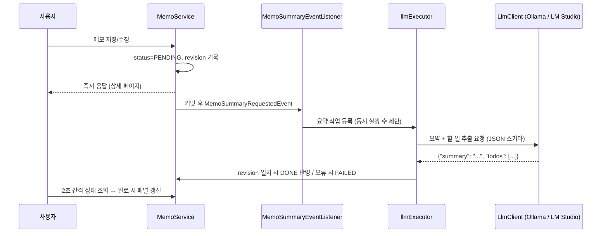

# AI Memo — AI 메모 자동 정리 프로그램

메모를 저장하면 로컬 LLM이 자동으로 **요약**하고 **할 일 목록**을 추출해주는 백엔드 시스템입니다.

## 주요 기능

- 메모 작성 및 저장 (제목, 본문, 작성일)
- 메모 저장 시 로컬 LLM 자동 호출을 통한 요약 및 할 일 추출
- 저장된 메모와 요약 결과 조회 (키워드 검색, 페이지네이션)
- 메모 수정 및 삭제 (내용이 바뀌면 자동 재요약)

## 기술 스택

| 구분 | 스택 |
|---|---|
| Backend | Java 21, Spring Boot 4.0.6, Spring Data JPA, Thymeleaf |
| Database | PostgreSQL (테스트: H2 PostgreSQL 모드) |
| AI 연동 | 로컬 LLM — **Ollama** / **LM Studio** (설정으로 전환) |
| 인프라 | Tailscale 기반 자체 서버 호스팅 |

## 요약 처리 흐름



- LLM 호출은 트랜잭션 밖에서 수행해 DB 커넥션을 오래 잡지 않습니다.
- 요약 중 메모가 수정·삭제되면 `revision`이 달라져 오래된 결과는 버립니다.
- 서버 재시작 시 끝나지 않은 요약(PENDING/PROCESSING)은 자동으로 다시 요청합니다.

## API

| Method | URL | 설명 |
|---|---|---|
| `POST` | `/api/memos` | 메모 작성 (201, 요약 자동 시작) |
| `GET` | `/api/memos?keyword=&page=&size=` | 메모 목록 (최신순, 검색) |
| `GET` | `/api/memos/{id}` | 메모 단건 + 요약 결과 |
| `PUT` | `/api/memos/{id}` | 메모 수정 (내용 변경 시 재요약) |
| `DELETE` | `/api/memos/{id}` | 메모 삭제 (204) |
| `GET` | `/api/memos/{id}/summary` | 요약 상태/결과 조회 |
| `POST` | `/api/memos/{id}/summary` | 재요약 요청 (202) |

## 실행 방법

### 1. 데이터베이스

```bash
createdb ai_memo
psql -d ai_memo -f src/main/resources/db/schema.sql   # prod(validate) 환경에서 필수, dev는 자동 생성
```

### 2. 로컬 LLM

| 런타임 | 준비 | 환경변수 |
|---|---|---|
| Ollama | `ollama pull qwen2.5:7b` | `LLM_PROVIDER=ollama`, `LLM_MODEL=qwen2.5:7b` |
| LM Studio | 모델 로드 후 Developer 탭에서 서버 시작 | `LLM_PROVIDER=lmstudio`, `LLM_MODEL=qwen2.5-7b-instruct` |

LLM 서버가 다른 머신(Tailscale)에 있다면 `LLM_BASE_URL=http://100.x.x.x:11434` 처럼 지정합니다.

### 3. 애플리케이션

```bash
export POSTGRESQL_DATABASE=ai_memo POSTGRESQL_USERNAME=... POSTGRESQL_PASSWORD=...
export LLM_PROVIDER=ollama LLM_MODEL=qwen2.5:7b
./mvnw spring-boot:run                                   # 기본 dev 프로파일, http://localhost:8083
./mvnw spring-boot:run -Dspring-boot.run.profiles=prod   # 운영
```

| 환경변수 | 기본값 | 설명 |
|---|---|---|
| `POSTGRESQL_HOST` / `POSTGRESQL_PORT` | `localhost` / `5432` | DB 주소 |
| `POSTGRESQL_DATABASE` / `USERNAME` / `PASSWORD` | - | DB 접속 정보 |
| `LLM_PROVIDER` | `ollama` | `ollama` \| `lmstudio` |
| `LLM_BASE_URL` | 런타임별 기본 주소 | ollama `:11434`, lmstudio `:1234` |
| `LLM_MODEL` | `qwen2.5:7b` | 모델명 |
| `LLM_API_KEY` | - | 인증 토큰 (선택) |
| `LLM_READ_TIMEOUT` | `120s` | LLM 응답 대기 시간 |
| `LLM_CONCURRENCY` | `1` | 동시 요약 수 |

### 테스트

```bash
./mvnw verify   # H2 + Fake LLM 클라이언트로 실행 (PostgreSQL·LLM 불필요)
```

## 브랜치 전략

| 브랜치 | 용도 |
|---|---|
| `master` | 배포 브랜치 (dev → master PR만 허용) |
| `dev` | 통합 개발 브랜치 |
| `feature/coding-test-{기능}` | 기능 단위 개발 브랜치, 완료 후 dev로 PR |
